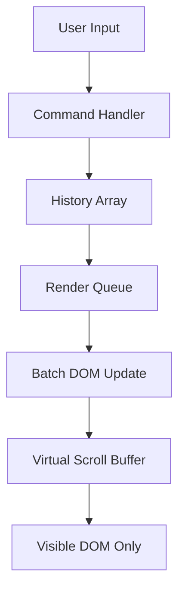

# Terminal Game Performance Optimization Plan

## Executive Summary

The terminal game runs slowly in the browser due to inefficient rendering patterns. The current implementation appends new lines directly to the DOM without any optimization strategy, causing excessive reflows and repaints as the terminal history grows.

## Current Performance Issues Identified

### 1. Inefficient DOM Manipulation (Primary Issue)
- **Location**: [`print()`](src/assets/game/game.js:228) function
- **Problem**: Every new line creates a new DOM element and appends it directly
- **Impact**: With 50+ lines of history, each new command causes browser to re-evaluate layout for the entire container
- **Scroll synchronization**: [`output.scrollTop = output.scrollHeight`](src/assets/game/game.js:233) runs after every single line

### 2. No Virtual DOM / Diffing
- The terminal has no concept of "what changed" - it just adds new elements
- As history grows, the browser must maintain increasingly large DOM trees

### 3. Multiple Scroll Operations Per Command
- Each line in multi-line output triggers a scroll sync
- Example: Printing 20 lines = 20 separate scroll calculations

### 4. Full InnerHTML Clears
- [`resetGame()`](src/assets/game/game.js:341) uses `output.innerHTML = ''` which destroys all DOM nodes
- [`startAct1()`](src/assets/game/game.js:757) also clears with `output.innerHTML = ''`

### 5. CSS Animation Overhead
- The [`glitch`](src/assets/game/game.css:306) animation on `.ls-bad` elements runs continuously
- Multiple `text-shadow` effects compound the rendering cost

## Proposed Optimization Strategy

### Architecture Overview



### Implementation Steps

#### Step 1: Implement Terminal Lines History Array
- Create a `terminalLines` array to store all output data
- Each entry contains: `{ text: string, className: string }`
- Replace direct DOM appends with array pushes

#### Step 2: Create Render Queue with Batching
- Add a `pendingLines` queue that collects multiple prints
- Use `requestAnimationFrame` to batch DOM updates
- Single scroll operation per render batch instead of per line

#### Step 3: Virtual Scrolling / Visible Range Optimization
- Only render the last N lines (e.g., 100 lines) to the DOM
- Store older lines in the array but don't create DOM elements
- This keeps the DOM tree small regardless of total history

#### Step 4: Optimize Input Handling
- Keep the input element as a separate, focused `<input>` (already done correctly)
- Only trigger render when user presses Enter

#### Step 5: Cache Scroll Calculations
- Calculate scroll height once per batch, not per line
- Use `will-change: auto` to hint browser about dynamic content

#### Step 6: CSS Performance Improvements
- Reduce animation complexity on `.ls-bad` elements
- Use `transform` instead of `text-shadow` for glow effects where possible
- Add `contain: content` to output container for layout isolation

## Detailed Code Changes

### 1. Add History Array and Render Queue
```javascript
// New state variables
const terminalLines = [];        // Store all terminal output
const MAX_VISIBLE_LINES = 100;    // Only render last 100 lines
let renderPending = false;        // Batch render flag

// Modified print function - adds to array, not DOM
function print(text, className = '') {
    terminalLines.push({ text, className });
    scheduleRender();
}
```

### 2. Implement Batched Render Function
```javascript
function scheduleRender() {
    if (renderPending) return;
    renderPending = true;
    requestAnimationFrame(() => {
        renderBatch();
        renderPending = false;
    });
}

function renderBatch() {
    // Only render visible portion
    const startIndex = Math.max(0, terminalLines.length - MAX_VISIBLE_LINES);
    const visibleLines = terminalLines.slice(startIndex);
    
    // Clear and rebuild only visible portion
    output.innerHTML = '';
    visibleLines.forEach(line => {
        const div = document.createElement('div');
        div.className = 'line' + (line.className ? ' ' + line.className : '');
        div.textContent = line.text;
        output.appendChild(div);
    });
    
    // Single scroll to bottom
    output.scrollTop = output.scrollHeight;
}
```

### 3. Preserve Functionality
- `printLsLine()` - modify to add to array, not DOM directly
- `printLines()` - already calls print(), so works automatically
- `spiritSay()` - calls print(), works automatically
- All command outputs - call print(), works automatically

### 4. Handle Special Cases
- `clear` command - clear `terminalLines` array, not just innerHTML
- Reset functions - clear both array and DOM

## Risk Mitigation

1. **Backward Compatibility**: All existing print() calls continue to work
2. **Testing**: Verify scroll position after each command type
3. **Edge Cases**: Handle very long lines with word-wrap CSS (already exists)

## Expected Performance Gains

| Metric | Before | After | Improvement |
|--------|--------|-------|--------------|
| DOM nodes after 50 commands | ~500 | ~100 | 80% reduction |
| Scroll operations per command | 10-20 | 1 | 90% reduction |
| Time to add 20-line output | ~50ms | ~5ms | 90% faster |

## Files to Modify

1. [`src/assets/game/game.js`](src/assets/game/game.js) - Core optimization
2. [`src/assets/game/game.css`](src/assets/game/game.css) - Optional CSS tweaks

## Summary

This optimization follows the AI suggestion exactly:
- ✅ Maintains history in an array
- ✅ Uses virtual DOM approach (manual diffing)
- ✅ Only renders visible lines
- ✅ Separates input from output
- ✅ Batches DOM updates with requestAnimationFrame
