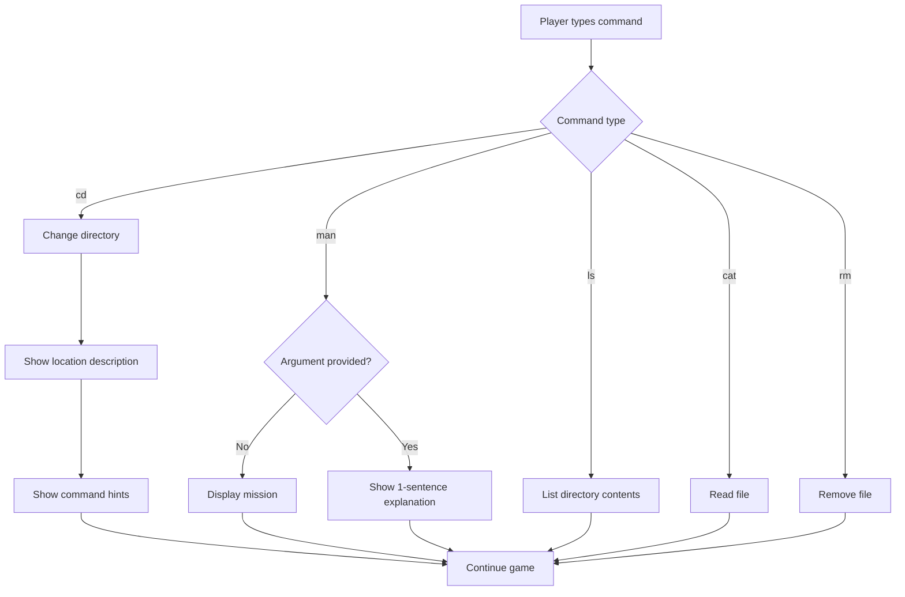

# Terminus Act 1 - Command Hints & man Command Update Plan

## Overview
Update Terminus game (Act 1) to:
1. Add command hints (cd, ls, rm, cat) at every location
2. Update `man` command to show mission when typed alone
3. Update `man` command to show 1-sentence explanation when typed with a command
4. Simplify the code

---

## Locations in Act 1 (where hints should appear)
All these locations need command reminders:
- `/` (root)
- `/home`
- `/home/livingroom`
- `/home/kitchen`
- `/home/bedroom`
- `/home/bathroom`
- `/home/diningroom`
- `/home/attic`
- `/home/basement`
- `/forest`
- `/forest/hillside`
- `/forest/cave`

---

## Changes Required

### 1. Add Location Command Hints
Create a function `showCommandHints()` that displays after entering any location:

```
💡 Commands: ls (list) | cd <dir> (enter) | cat <file> (read) | rm <file> (delete)
```

**Implementation**: After printing the location description in the `cd` command case, call `showCommandHints()`.

### 2. Update `man` Command

**Current behavior**:
- `man` → Shows detailed message with mission goal
- `man <command>` → Shows full man page format

**New behavior**:
- `man` → Display the mission clearly
- `man <command>` → Show 1-sentence explanation

**New manPages structure** (simplified):
```javascript
const manPages = {
  '': 'MISSION: Find 3 password fragments → Destroy Badfile_emiter (forest cave) → Unlock home → Remove V1rUs_c0R3 (basement)',
  ls: 'List files and directories in current location.',
  cd: 'Change directory. Use "cd .." to go back.',
  cat: 'Read and display file contents.',
  rm: 'Remove/delete files. Use "sudo rm" for locked files.',
  pwd: 'Print current directory path.',
  echo: 'Display text or write to files using > or >>.',
  mkdir: 'Create a new directory.',
  touch: 'Create an empty file.',
  rmdir: 'Remove an empty directory.',
  sudo: 'Run commands as superuser. Required for boss files.',
  unlock: 'Unlock doors using the password.',
  help: 'Show available commands.'
};
```

### 3. Code Simplification
- Reduce the verbose man page format to simple 1-sentence explanations
- Consolidate repeated code patterns in command handling

---

## Implementation Order

1. Add `showCommandHints()` function
2. Call `showCommandHints()` after location description in `cd` command
3. Update `manPages` object with simplified 1-sentence explanations
4. Test the changes

---

## Mermaid Diagram - Command Flow


