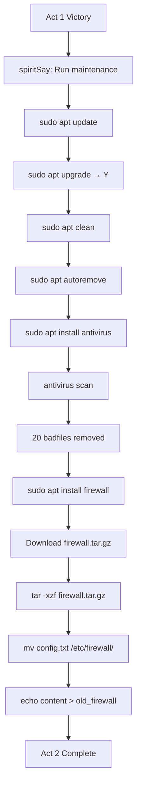

# Terminus Act 2 - System Maintenance (DETAILED)

## Overview
Act 2: System Maintenance - After defeating V1rUs_c0R3, the system needs updates, antivirus, and firewall installation.

## Story Flow

1. **Victory from Act 1** → Spirit Guide suggests system maintenance
2. **apt update** → apt upgrade → apt clean → apt autoremove
3. **Spirit**: "Now install protection: antivirus and firewall"
4. **Antivirus install** → run scan → removes 20 badfiles
5. **Firewall install** → fake download → extract → move → copy/paste content

---

## New State Variables

```javascript
let aptUpdated = false;
let aptUpgraded = false;
let aptCleaned = false;
let aptAutoremoved = false;
let antivirusInstalled = false;
let firewallInstalled = false;
let badfilesRemoved = 0; // Track until 20
```

---

## New Commands

### apt Suite (extend existing sudo handler)

**`sudo apt update`**
- Print: "Reading package lists... Done"
- Set `aptUpdated = true`
- Spirit: "Package lists refreshed. Run 'sudo apt upgrade' to install updates."

**`sudo apt upgrade`**
- Require `aptUpdated` first
- Show: "The following packages will be upgraded: libc6, systemd, openssl"
- Prompt: "Do you want to continue? [Y/n]"
- On Y: simulate progress, set `aptUpgraded = true`
- Spirit: "System packages upgraded. Run 'sudo apt clean' to clear cache."

**`sudo apt clean`**
- Require `aptUpgraded` first
- Clear /var/cache/apt/archives/
- Print: "Cleared package cache. Freed 45MB."
- Spirit: "Cache cleaned. Run 'sudo apt autoremove'."

**`sudo apt autoremove`**
- Require all previous apt commands
- Set `aptAutoremoved = true`, `systemMaintained = true`
- Spirit: "System maintenance complete. Install antivirus: sudo apt install antivirus"

---

### Antivirus System

**`sudo apt install antivirus`**
- Require `systemMaintained` first
- Prompt for password (reuse PASSWORD = 'password1')
- On success: set `antivirusInstalled = true`
- Print: "Antivirus installed. Type 'antivirus' to run scan."

**`antivirus`** (standalone command)
- Require `antivirusInstalled`
- Scan: find all files named exactly "badfile"
- Exactly 20 badfile instances exist
- For each: print "Scanning /path... INFECTED → REMOVED"
- Remove all 20 using existing rm logic
- Spirit: "Threats eliminated. Now install firewall: sudo apt install firewall"

---

### Firewall System

**`sudo apt install firewall`**
- Require `antivirusInstalled` and `badfilesRemoved >= 20`
- Print: "Downloading firewall package..."
- Simulate progress: "0%... 25%... 50%... 75%... 100%"
- Create /tmp/downloads/firewall.tar.gz
- Set `firewallDownloaded = true`
- Spirit: "Package downloaded. Extract: tar -xzf firewall.tar.gz"

---

### tar Command (NEW)

**`tar -xzf <file>`**
- Check cwd has the tarball file
- Extract to directory named after file (without .tar.gz)
- Create firewall/ directory with config.txt inside
- Print: "Extracted 'firewall.tar.gz' to 'firewall/'"

---

### Manual Firewall Installation Steps

1. `cd /tmp/downloads` → `ls` → see firewall.tar.gz
2. `tar -xzf firewall.tar.gz` → extracts to firewall/
3. `cd firewall` → `ls` → see config.txt
4. `cat config.txt` → shows: "FIREWALL_RULES=strict\nDEFAULT_POLICY=deny\nLOG_LEVEL=verbose"
5. **mv config.txt /etc/firewall/** (need /etc/firewall/ to exist)
6. **cd /etc/firewall** → **ls**
7. **echo "FIREWALL_RULES=strict\n..." > old_firewall** (copy-paste simulation)
8. **cat old_firewall** → verify content

---

## Filesystem Changes

### Add 20 badfile instances (type: 'file')

```
home/livingroom/badfile
home/kitchen/badfile
home/bedroom/badfile
home/bathroom/badfile
home/diningroom/badfile
home/attic/badfile
home/basement/badfile
var/cache/badfile
var/log/badfile
tmp/badfile
etc/badfile
usr/share/badfile
forest/hillside/badfile
forest/cave/badfile
lost+found/badfile
home/livingroom/nested/badfile (create nested dir)
var/cache/apt/badfile
tmp/downloads/badfile
etc/config/badfile
```

Each badfile content: "MALWARE_SIGNATURE=detected\nTHREAT_LEVEL=high\nSTATUS=quarantined"

### New directory structure

```
var/
  cache/
    apt/
      archives/ (empty)
    badfile
  log/
    badfile
tmp/
  downloads/ (empty)
  badfile
etc/
  firewall/ (empty)
  config/
    badfile
  badfile
usr/
  share/
    badfile
lost+found/
  badfile
```

---

## Entry Point

After Act 1 boss defeat, add to victoryMessage() or handleSudoPassword():
```javascript
spiritSay('Virus core eliminated. But the system is fragile. Run maintenance: sudo apt update, then upgrade, clean, and autoremove.');
```

---

## Sequential Gates (Critical)

1. apt upgrade requires aptUpdated
2. apt clean requires aptUpgraded
3. apt autoremove requires aptCleaned
4. apt install antivirus requires aptAutoremoved
5. antivirus command requires antivirusInstalled
6. apt install firewall requires badfilesRemoved >= 20
7. tar requires firewallDownloaded

---

## Testing Sequence

```
sudo apt update
sudo apt upgrade → Y
sudo apt clean
sudo apt autoremove
sudo apt install antivirus → password
antivirus (finds/removes 20 badfiles)
sudo apt install firewall → password
cd /tmp/downloads
ls (see firewall.tar.gz)
tar -xzf firewall.tar.gz
cd firewall
cat config.txt
mv config.txt /etc/firewall/
cd /etc/firewall
echo "FIREWALL_RULES=strict\nDEFAULT_POLICY=deny\nLOG_LEVEL=verbose" > old_firewall
cat old_firewall (verify)
```

---

## Mermaid Diagram - Act 2 Flow


